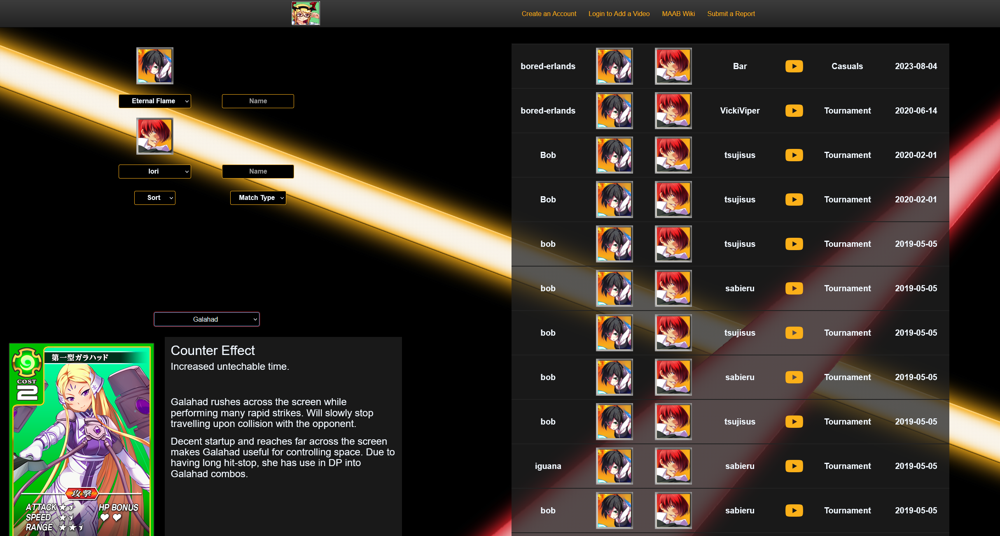

# Video Database for Million Arthur: Arcana Blood

[Enchant-Boost.Net](https://www.enchant-boost.net/)

Tech Stack: 
- MongoDB
- NodeJS
- Express
- ReactJS
- Heroku

::github{repo="akp4657/enchant-boost"}

Solo project built in the MERN stack very similar to Ignite-Boost. This had a different circumstance compared to [Ignite-Boost](https://www.ignite-boost.net/). [Enchant-Boost](https://www.enchant-boost.net/) is for a much smaller game and community: Million Arthur: Arcana Blood. I had a few friends who were community leaders and top players for the game, and had noticed that they kept their video database in an Excel file rather than on a site like [Replay Theater](https://replaytheater.app/). So, I made some adjustments and launched Enchant-Boost for the community that's still actively used by said community to this day.

Enchant-Boost has the same stack as Ignite-Boost, but Enchant-Boost's modifications are specific to Million Arthur as well as having some database optimizations. Much like Ignite-Boost, I'm working on the Angular re-work to better represent my current tech stack.

