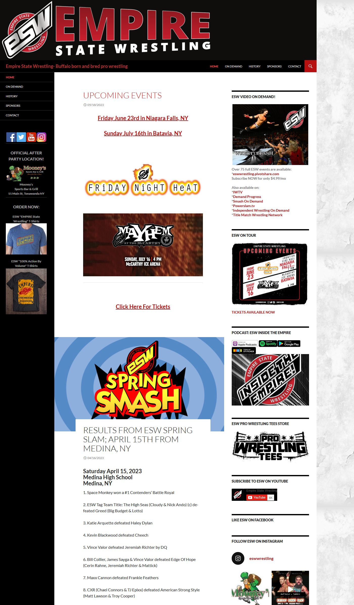
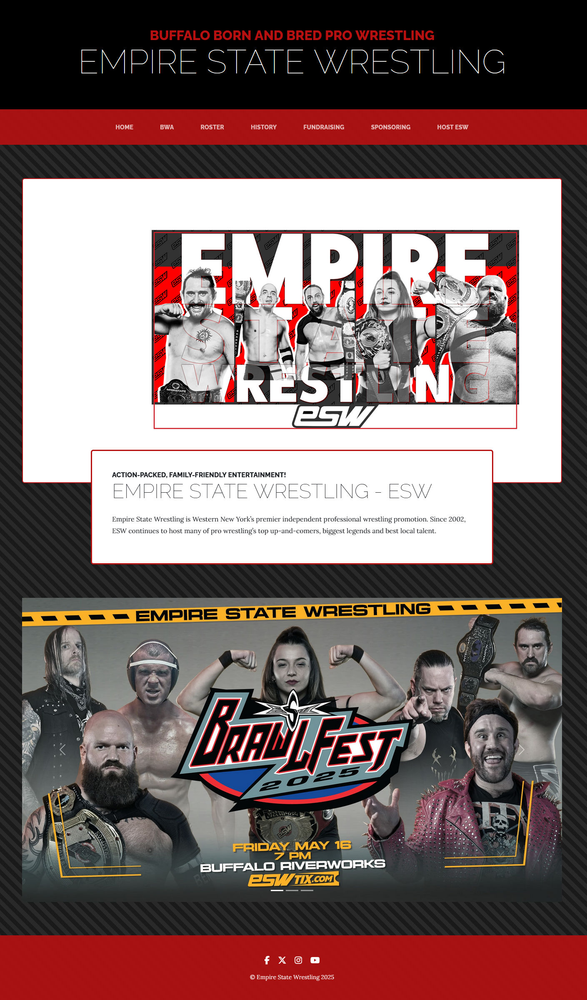

# Website Rework for Empire State Wrestling

Tech Stack: 
- Bootstrap
- PUG
- Vercel

::github{repo="akp4657/esw"}

Solo project to rework the website for Empire State Wrestling (ESW), the biggest wrestling promotion in the Western New York region. The main features requested were a dynamic roster and history pages. However, the crux of the rework is to allow users to easily navigate to tickets, merchandise, and sponsorship opportunities.

The website is constantly being updated as wrestlers come and go, events change, and championships change hands.

## Comparison of Designs

**Old**:

**New**:

