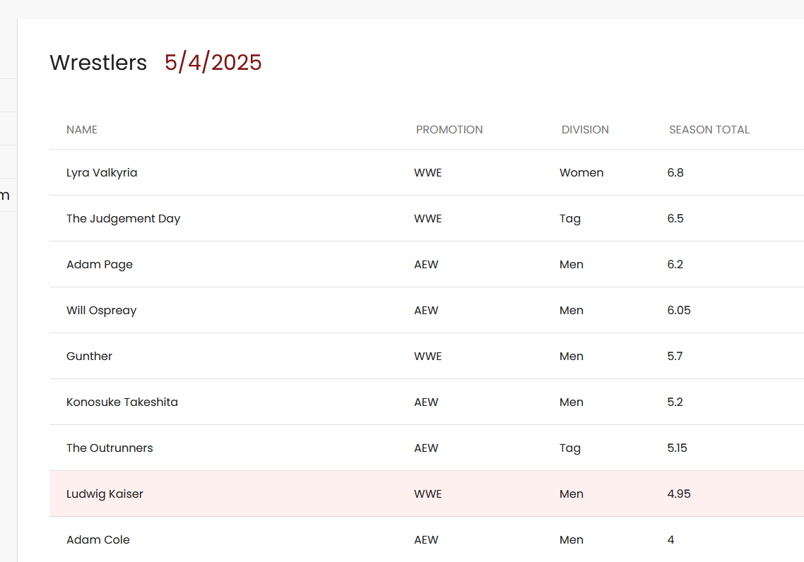

# Pro Wrestling Fantasy Sports with Real Life Wrestlers

[Fantasy Graps](https://www.fantasygraps.com/)

Tech Stack: 
- AngularJS
- NodeJS
- MongoDB
- Zoho API

::github{repo="akp4657/pwfantasy"}

### What is Fantasy Graps?
Fantasy Graps is an online game where participants manage a virtual roster made up of real professional wrestlers. Points are earned based on the wrestlers' real-world performance in matches and presence on the show. You compete against other players' fantasy teams throughout a season to win the league!

FG is a solo project building an application for a fantasy sports game revolving around pro wrestling. Users draft a roster of real life wrestlers and follow their performance week to week in order to gain the most points to win! Built in the MEAN stack, the main feature is an integration with Zoho sheets that allows me to update all relevant data in one spreadsheet while a job updates the points and updates for each wrestler in each user's team every five minutes. 

