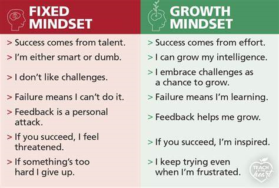

This post was originally posted on [SandBox Union's blog](https://sandboxunion.com/growth-mindset-in-development/), written by me on November 1, 2024.

Failure is something that we all must contend with. Failure is an inherent feature throughout software development. Failure is prevalent in all aspects of life. While failure is something that is often shunned, it should instead be taken as an opportunity to grow. Failure should be seen as a good thing where we have the freedom to view it as such. However, it seems that many developers have a fixed mindset when it comes to their work. Having the perfect product every time, only considering the solution as finished if it is fully optimized, or even becoming defensive during code reviews/looking at other developers’ solutions. As developers, we need to constantly have our ear to the ground to adapt with the breakneck pace of the industry. With that comes the ability, and willingness, to fail often and sometimes catastrophically. Of course, when I’m talking about the ability to fail, I’m referring to a growth mindset. So, how should developers try to incorporate the growth mindset into their professional and personal lives?

Well, we can’t start talking about the growth mindset without first defining it. You may have seen this graphic hung up in classrooms when you were going through school:

I know I certainly resonated with some of the points in the fixed mindset column, sometimes I still resonate with some of those points. It’s easy to lean into the fixed mindset when things are difficult, as we’ve been conditioned to only see success and failure in a binary. Either you did the assignment, or you failed. If you failed, then things just began spiraling downwards. Of course, this is all common knowledge with the education system most of us went through. That doesn’t mean it’s healthy, though. A fixed mindset can be a detriment to your performance over time. As we all know, software has no intention of slowing down any time soon. If we’re too caught up in not wanting to fail or take on challenges, then we’ll eventually fall by the wayside in tech. I want to take you through 5 different points when challenging your fixed mindset and moving towards a growth mindset:

1.  Embrace Failure

2.  Face Challenges Head On

3.  Pay Attention to Your Self-Talk

4.  Redefine 10x Developer

5.  Trust the Process

## Embrace Failure

As I initially stated in this little blog post, we need to be more comfortable with failing. Failing in any activity in life is a feature. We will fail at some point. It’s not a question of if it’s going to happen, but when it’s going to happen. So, we need to have the skillset to be able to handle said failures with grace. What I mean here is to take those failures and try to learn something from them. For example, if I’m unable to complete a challenge problem on CodeWars. While it sucks to have to reveal the answer and lose my progress on points, I can get a deeper understanding of the problem and solution by looking at solutions and discussions from those other developers. It’s better to transfer those feelings of frustration and disappointment when failing to feelings of curiosity. Instead of beating yourself up about an error with a small one-line fix that took days to find (thx JavaScript); instead, focus on how you can future proof the next bit of code you plan to write so this problem doesn’t happen in the future.

## Face Challenges Head On

This can be daunting, especially in a professional environment. For many developers, they aren’t considered the “go-to” developer in the company. Even so, I challenge you to start tackling greater and greater problems. You will likely fail a lot trying to do so, but you will come out of it a better developer. As I’ve had the unique opportunity to primarily work in start-up environments, I’ve been given the freedom to tackle problems and tasks that I was essentially destined to fail. With these problems and tasks that I failed at, I was able to accelerate my growth as a developer to become a leader at SandBox Union. If this option isn’t available to you, there are plenty of open-source projects that could use a hand with tasks up on GitHub. I have a few pull requests that happened by accident when just browsing open-source projects. Looking at other, perhaps larger codebases, can really help with your ability to read others’ code and digest potential issues quickly. A super valuable skill to have in development, and your could develop this as well as helping your mindset by willingly diving into difficult projects you otherwise wouldn’t have gone near.

## Pay Attention to Your Self-Talk

A lot of people in competitive environments (let’s be real, coding is a competitive environment) tend to have a good amount of confidence in themselves. This is extremely important to have so you don’t hinder your potential by limiting your mental capacity. As in, saying “Oh, I can’t do this. It’s too hard.” will make said activity seem far more difficult than it is, even when working to complete that activity. Instead, it may just be better to tell yourself “This is all me. I’m the best developer this company has!” …Initially, this may come off as being arrogant or conceited. Which, it could be. The importance of this type of talk is that it’s targeted towards yourself. It’s self-talk after all, so nobody else needs to hear it, but it has the same effect regardless. If instead we direct our self-talk away from the failure that happens in our daily lives to reassure ourselves and move to the next challenge, our growth as developers could see massive gains. For example, say a fix I implemented ended up breaking our QA environment because of a package I didn’t realize needed to be there. Super specific, but still applicable to a lot of people. Initially, it’s easy to just talk to yourself very negatively.

“Oh, I’m so stupid how could I do that?”

“They are probably really mad at me now.”

“I’m never pushing to QA on my own again.”

You can pivot all these thoughts to positive self-talk that nurtures the growth mindset.

“Ah, just made a mistake. It happens.”

“Things are hectic, but I can handle this quickly.”

“Next time I push, I’ll make sure to double check and have others check if it’s big enough.”

## Redefine 10x Developer

So, this is more of a stereotype than anything, but it’s still something that I see developers talk about relatively often. Essentially, a 10x developer is like the “gifted kid” or “geniuses” that we grew up with or were. Someone who understands coding, problem solving, and their language to a seemingly inhuman level. However, in my opinion, what separates these developers from others is simply the mindset and passion for problem solving. Being able to recognize that you don’t know enough and are willing to seek out the answers is a huge part in becoming a better developer. Of course, it takes a lot of hard work and passion to implement these problem solving techniques in a meaningful way to us. But still, the first step on this road to 10x is to break free of fixed/results based thinking.

## Trust the Process

I repeat this to myself very often. In software, in life, a lot of times we’re left to just trust the process. With transitioning into a growth mindset, it’s also going to take time. The brain is a finicky thing, and it will try to yank you back into familiar territory whenever possible. You will not see growth transitioning your mindset right away. In fact, you will probably fail the first time you try to get to more of a growth mindset. Even so, it’s well worth the initial struggle.

Once we can break free of the stigma of failure and focus on our growth, we can more easily achieve our full potential. And, to grow to your full potential as a developer, staying curious and willing to learn is what many companies—and people look for. So, I challenge you reading this to take the plunge into the growth mindset and see how far it can take you!

