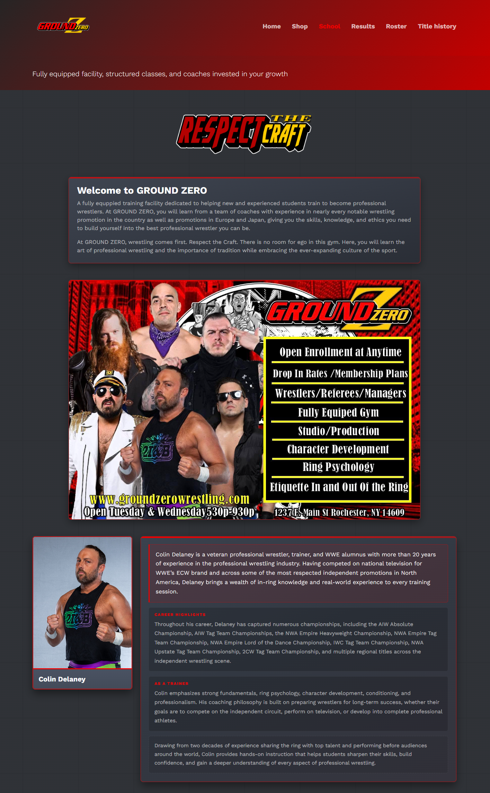

# Website Design for Ground Zero Wrestling

[Ground Zero Website](https://www.groundzerowrestling.com/)

Tech Stack: 
- Bootstrap
- PUG
- Vercel

::github{repo="akp4657/groundzero"}

Solo project to rework the website for Ground Zero Wrestling, the premier wrestling organization in Rochester, New York. The main features requested was reworking the school's page to be more attractive to prospective students. In addition, this rework promotes Ground Zero and Wild Zero jointly as promotions with a roster page, recent results, and quick navigation to upcoming shows and events.

The website is constantly being updated as wrestlers come and go, events change, and championships change hands.

## Primary School Page Design

