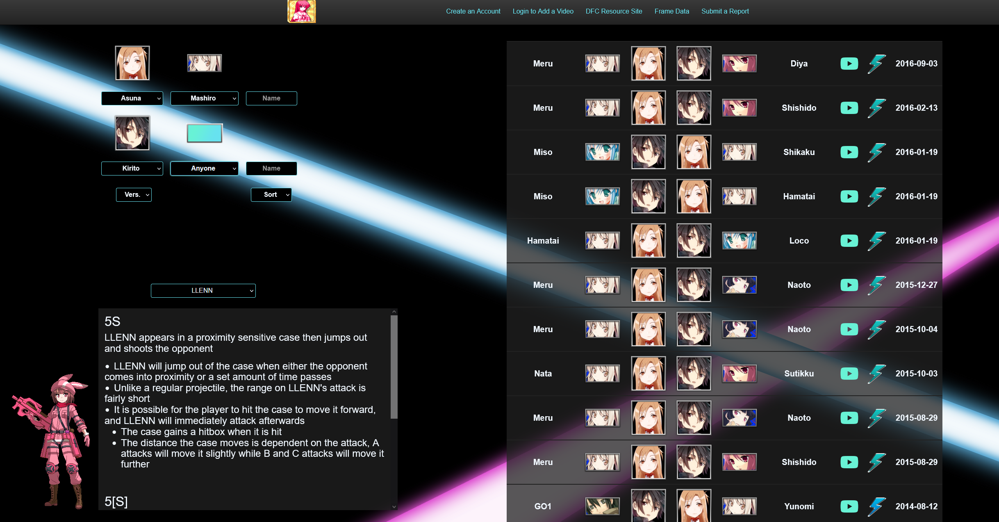

# Video Database for Dengeki Bunko Fighting Climax Ignition

[Ignite-Boost.Net](https://www.ignite-boost.net/)

Tech Stack: 
- MongoDB
- NodeJS
- Express
- ReactJS
- Heroku

::github{repo="akp4657/ignite-boost"}

Solo project built in the MERN stack. An issue I discovered while playing and competiting in Dengeki was that there was no centralized place to find videos of matches. Like most activities, watching film is a vital
component to improving. In the fighting game community, there are many dedicated sites to upload and watch film back. A popular one amongst the community is the [Replay Theater](https://replaytheater.app/). However, this
wasn't around during the rapid growth period of Dengeki's community. So, during my final year at RIT, I developed and deployed [Ignite-Boost](https://www.ignite-boost.net/).

Ignite-Boost was built in the MERN stack along with tools such as Handlebars, Babel, and CI/CD. It's currently hosted using Heroku with a Production and QA environment. The website receives feedback through my personal Discord server for the site as well as direct communication with community members. As of today, the website hosts over 17,000 entries of videos for Dengeki Bunko Fighting Climax. This is the largest public video database for the game that exists online. As of writing, I'm working on an Angular re-work for both Ignite-Boost and Enchant-Boost in Angular to represent my current stack.

