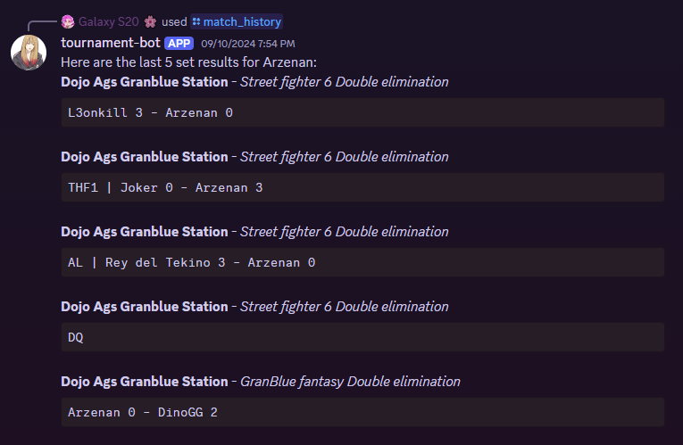

# StartGG Discord Bot (WIP)

Tech Stack: 
- StartGG API (GraphQL)
- DiscordJS
- NodeJS
- JavaScript

::github{repo="akp4657/discordbot"}

My current WIP project. This is a Discord bot built with DiscordJS and StartGG's GraphQL API. For many tournaments in esports, most organizers choose to use StartGG as it's easily scalable for large events such as these. However, a main issue users have had with the application is that it is unoptimized for mobile and it doesn't have a mobile app. As such, during events, it's difficult for competitors and spectators alike to 
view their matches with any sort of consistency on their phone. This Discord bot mitigates this issue by showing relevant data quickly and easily. Currently, I'm the only user for this bot though I do plan to release it to the community later in the year. 

As of writing, the bot has commands to search for tournaments for specific games in your state/region, look up recent match statistics, and display a user's upcoming matches.

